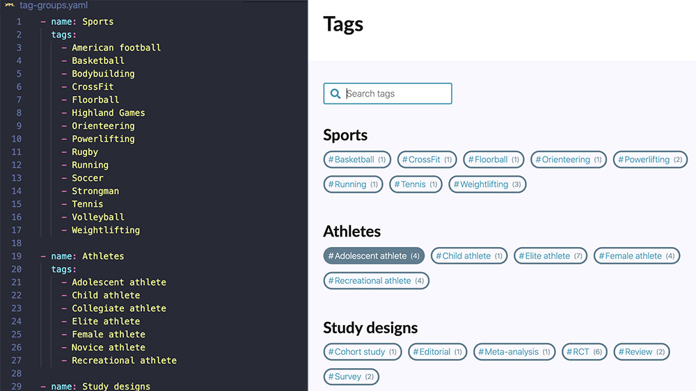
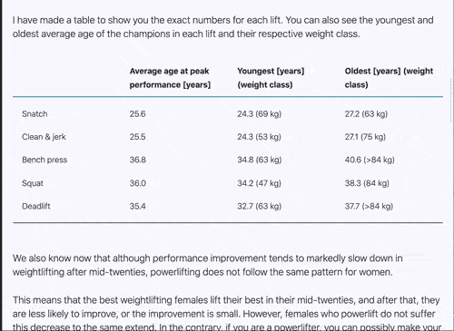
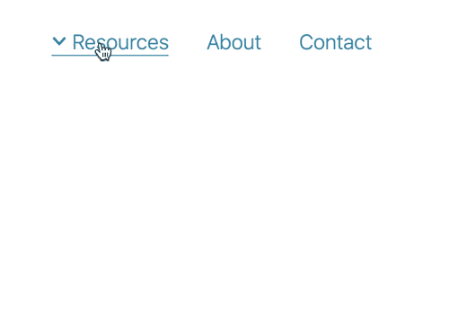

# evidencestrong.com

It's a snapshot copy of a private repo. It does not contain all content (posts) of the https://evidencestrong.com website.

Built with Gatsby, React, Styled components (Emotion), MDX, Formik, Netlify, Github actions.

## Features

### Taxonomy

- Posts categories ([`content/data/categories.yaml`](content/data/categories.yaml)).
- Two-level tags (tags groups) defined at [`content/data/tag-groups.yaml`](content/data/tag-groups.yaml), and searchable:



### Drafts and posts scheduling

- Posts drafts support as a custom plugin ([`plugins/drafts/gatsby-node.js`](plugins/drafts/gatsby-node.js)). Only post that have specifed date and the date is in the past, will be visible after production build.
- Posts scheduling using Github actions to automically trigger Netlify builds:

```yaml
name: Trigger Netlify Build
on:
  schedule:
    # Run at 1:00 am UTC (10:00 am Tokyo time) on Tue and Thu
    - cron: "0 1 * * 2,4"
jobs:
  build:
    name: Request Netlify Webhook
    runs-on: ubuntu-latest
    steps:
      - name: Curl request
        run: curl -X POST -d {} https://api.netlify.com/build_hooks/XXX
```

### Responsive tables



Usage:

```jsx
<Table>
  <Cell header label></Cell>
  <Cell label>Snatch</Cell>
  <Cell label>Clean &amp; jerk</Cell>
  <Cell header>Average age at peak performance [years]</Cell>
  <Cell>25.6</Cell>
  <Cell>25.5</Cell>
  <Cell header>Youngest [years] (weight class)</Cell>
  <Cell>24.3 (69 kg)</Cell>
  <Cell>24.3 (53 kg)</Cell>
  <Cell header>Oldest [years] (weight class)</Cell>
  <Cell>27.2 (63 kg)</Cell>
  <Cell>27.1 (75 kg)</Cell>
  <Cell footer />
</Table>
```

- Implementation: [`src/components/widgets/table.js`](src/components/widgets/table.js).
- Usage example: [`content/posts/at-what-age-are-we-the-strongest-surprising-truth.mdx`](content/posts/at-what-age-are-we-the-strongest-surprising-truth.mdx) and other posts.

### Contact form

Contact form using Formik ([`src/components/contact-form.js`](src/components/contact-form.js)) and Netlify Forms.

### SEO

- SchemaOrg
- Open Graph
- Twitter Cards

### Dropdown menu



Configurable dropdown menu [`content/data/menu.yaml`](content/data/menu.yaml):

```yaml
- value: Resources
  slug: /category
  subMenu:
    - value: 3 mins drills
      slug: /3-mins-drill
    - value: What? Why? How?
      slug: /what-why-how
    - value: Free exercise programmes
      slug: https://healthylivingscience.com/projects/online-exercise-based-sports-injury-risk-reduction-programmes

- value: About
  slug: /about

- value: Contact
  slug: /contact
```

### Instagram profile links list page

Linktree-like page for sharing links in Instagram profile ([`src/pages/clickme.js`](src/pages/clickme.js)).

## Usage

```bash
# install
yarn

# dev build and server
yarn start

# production build
yarn build
```
