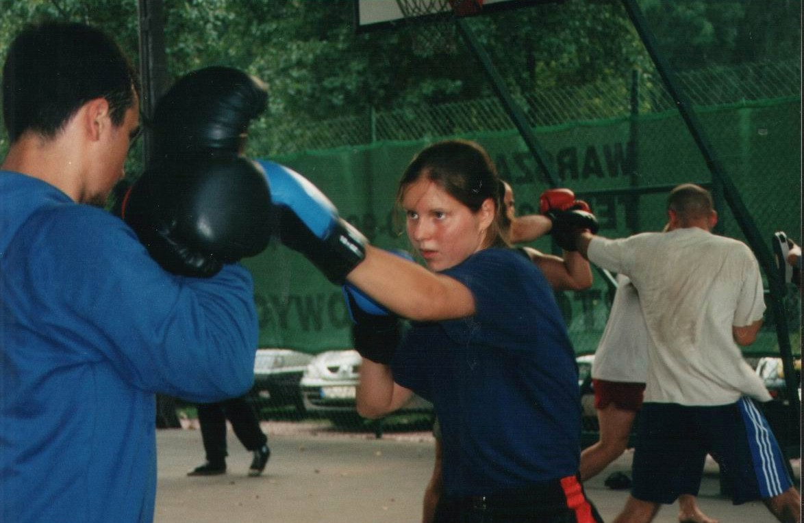

Hi, I'm Alex!

Evidence Strong was born to support athletes across the lifespan by bringing evidence knowledge in a digestible form.

## Storytime - the 'why'

I always loved sports. Playing sports made me happy, confident, and ... sore 😉. From time to time, it made me injured too. Why did the injury happen on this day, not on the other? Why me, not another athlete in my team/club? Could I have done something to prevent these injuries from happening in the first place?

After a while, it was clear that I had to learn more about the human body and sports injuries, so I have entered a physiotherapy (physical therapy) undergraduate course, and soon after that, a master’s degree course (both in the Wroclaw Medical University, Poland). Although I truly enjoyed learning and helping patients, many of my questions on "why?" remained unanswered.

I did not see any other way than going into a PhD program. Little did I know that this PhD program (University of Otago, New Zealand) will change my life.

Let's back up for a minute though.

Going through the years of schooling I was convinced that all we read in textbooks is 100% true. Oh, boy! I have not been prepared to discover a mashup of assumptions, misinterpretations, oversimplifications, exaggerations, and straight-up "not truth" presented to us during our education.

Spending these few years working on my PhD project and going deep into the world of science, has taught me how little we actually know "for sure". We still have to assume many things or just go with our best guess. My PhD journey has shown me how much humanity needs science to constantly go forth and back, to progress our understanding of the world, including the understanding of our bodies.

At the time of my undergrad, the Internet grew in popularity, and knowledge became ubiquitous. Also, the knowledge related to the human body and health. Social media have become the go-to news source, and a fleet of influencers emerged.

The sea of knowledge on the Internet started to grow exponentially. Unfortunately, the growth was highly influenced by the profit that could be made. Even the information about health was increasingly used to sell products. Misleading and downright wrong statements become an obvious problem.

This brought me to the realization that if scientists will not get involved in the creation of the content on the Internet, we are doomed. If scientists will not counterbalance the misinformation with their deep understanding and knowledge on the subject, we are lost. I felt a calling, a responsibility and a passion to start Evidence Strong.

### For whom?

This website is for athletes, their parents, coaches, and medical and sports-related personnel. Whoever aims at broadening their knowledge to better assist the athletes in their journey to performance and optimal health will find it useful (I hope). If you want to use this website to just stay on top of the ever-changing landscape of research in the area of sports medicine, it's fine by me too. Enjoy!

### What you can expect from me?

#### A promise

I will provide you with evidence-based knowledge from the sports medicine research literature that may be relevant to athletes and their development as a healthy, successful performer in their discipline.
Please remember that this is not medical advice (as I am not a medical doctor) and should not replace a consultation with a qualified health professional.

#### Types of content

I have organized the content of this website into Categories, so you can easily find what you need. The categories I have now are:

**3 mins drill** - Let me provide you with a short summary of the newest, interesting, or important research papers in sports performance and injury prevention. Or just the ones that caught my attention and deserve to be promoted. These are usually summaries of RCTs (randomized controlled trials) testing the effects of interventions on athletes in different sports.

I may or may not be slightly biased towards strength related topics. Enjoy!

**What? Why? How?** are the articles answering interesting questions in sports performance and injury prevention.

**Database** of the **exercise injury prevention programs** - it is a database with links to the exercise programs aiming at reducing injuries in different sports and groups of athletes. Additionally, I have assessed the quality of each website these programs are hosted on, and the quality of the way this information is presented. I hope this assessment will help you to decide whether you can adopt the program as it is (high-quality programs designed for your sport, age group, sex) or modify and consult (lower quality programs or less targeted to your specific needs) the program with a specialist (coach, physical therapist, sports doctor).

**Guidelines** - these are the summaries of the clinical guidelines in sports medicine.

If you want to browse content on injury prevention, performance, or specific sport or group of athletes you can use the [Tags page](/tags).

I will add more things here, as they develop.

Please feel free to send your suggestions on the topics or formats via the [Contact form](/contact).

## Yours truly

My name is Alex Mącznik. I have a PhD in Physiotherapy (2015) from the University of Otago (Dunedin, New Zealand). I am a first-generation PhD in my family. To get my PhD I had moved from Poland to New Zealand, and then to Japan to do a postdoc. At the moment, I am working as a visiting researcher at Keio University (Tokyo, Japan).

In my research, I investigate how exercises can be used to reduce the risk of sustaining injuries in female athletes.

You can also find me here:

[www.AlexMacznik.com](http://www.alexmacznik.com) - academic publications and updates

## Final words

All opinions presented on this website are mine and are not the opinions of my employers.

I care about the wellbeing of athletes. This website is one researcher's contribution to knowledge translation from research into practice. I hope to provide you with some free info, answer your questions, or maybe even teach you a thing or two, so you can flourish as an athlete or a supporter.

If you have any suggestions or requests for the topics I cover, you can always contact me using the [Contact form](/contact).

<!-- If you don't want to miss any new content on this website, please consider subscribing to be notified by clicking the button below. -->
